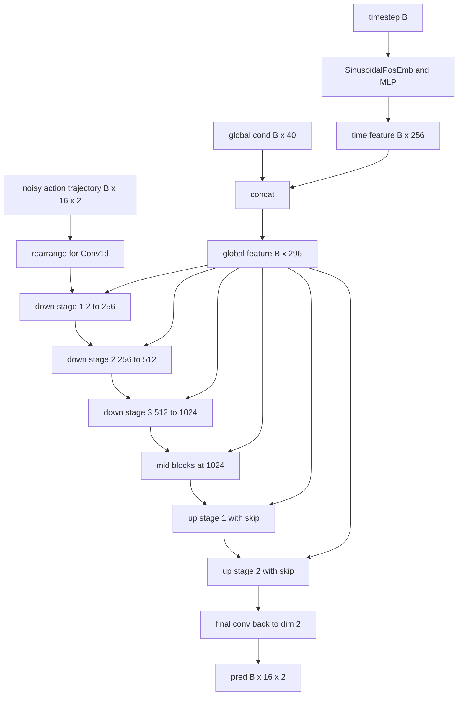
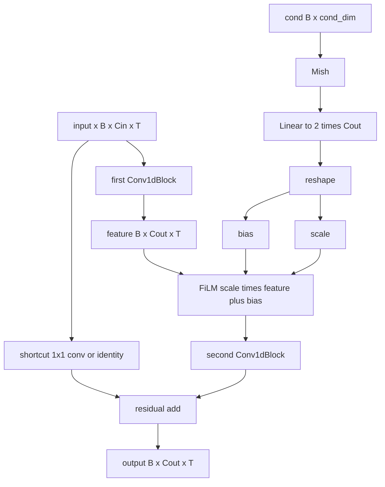

# Push-T Lowdim UNet 代码流程图

这份说明只关注这套仓库里最基础、最适合入门的链路：

- 任务：`Push-T`
- 输入：lowdim 观测
- 策略：`DiffusionUnetLowdimPolicy`
- 主干网络：`ConditionalUnet1D`

建议从这条链开始读：

`train.py -> train_diffusion_unet_lowdim_workspace -> pusht_lowdim 配置 -> pusht_dataset -> diffusion_unet_lowdim_policy -> conditional_unet1d -> pusht_keypoints_runner -> pusht_keypoints_env`

## 1. 训练主线

训练入口是 `train.py`，它根据 Hydra 配置实例化 `TrainDiffusionUnetLowdimWorkspace`。workspace 会同时构造三部分对象：

- `PushTLowdimDataset` 和 `DataLoader`
- `DiffusionUnetLowdimPolicy`
- `PushTKeypointsRunner`

训练循环里，每次先从 DataLoader 取一个 batch。这个 batch 已经是固定长度窗口，包含：

- `obs: [B, 16, 20]`
- `action: [B, 16, 2]`

然后 policy 会先对 `obs/action` 做归一化，再根据当前配置构造条件信息。默认 lowdim 配置下，前 `2` 步 `obs` 会被展平为 `global_cond`，而整段 `action` 会作为 diffusion 的训练目标 `trajectory`。

接着 scheduler 会按随机 timestep 给 `trajectory` 加噪，得到 `noisy_trajectory`。`ConditionalUnet1D` 的任务就是在 `global_cond` 条件下，根据 `noisy_trajectory` 和 timestep 预测噪声。最后把预测结果和真实噪声做 MSE，反向传播并更新参数。

训练过程中，workspace 还会周期性调用 `PushTKeypointsRunner` 做 rollout，用当前 policy 在环境里跑一遍，检查策略是否真的学会了 Push-T。

## 2. 推理主线

推理入口通常是 `PushTKeypointsRunner.run()`。runner 会在环境里持续维护最近 `n_obs_steps` 个观测，然后把它们整理成 `obs_dict` 传给 `policy.predict_action()`。

`predict_action()` 先对输入观测做归一化。默认配置下，它会把前 `2` 步 `obs` 展平为 `global_cond`，然后初始化一条高斯噪声 action trajectory。之后开始真正的 diffusion 反向采样：遍历 scheduler 的时间步，在每个 timestep 上都调用一次 `ConditionalUnet1D`，预测当前噪声，并由 scheduler 把轨迹更新到更干净的状态。

当整条 action trajectory 去噪完成后，policy 会先做反归一化，再从整段预测里切出当前要执行的 `n_action_steps`。所以推理时的关键点不是“直接输出一步动作”，而是“先生成一段动作计划，再执行其中一部分”。

## 3. 代码链和关键接口

### 3.1 入口

文件：`train.py`

关键接口：

```python
@hydra.main(...)
def main(cfg):
    cls = hydra.utils.get_class(cfg._target_)
    workspace = cls(cfg)
    workspace.run()
```

职责：

- 读取 Hydra 配置
- 根据 `_target_` 实例化 workspace
- 启动训练主循环

### 3.2 Workspace

文件：`diffusion_policy/workspace/train_diffusion_unet_lowdim_workspace.py`

关键接口：

```python
class TrainDiffusionUnetLowdimWorkspace(BaseWorkspace):
    def __init__(self, cfg, output_dir=None):
        ...

    def run(self):
        dataset = hydra.utils.instantiate(cfg.task.dataset)
        self.model = hydra.utils.instantiate(cfg.policy)
        env_runner = hydra.utils.instantiate(
            cfg.task.env_runner,
            output_dir=self.output_dir
        )
        ...
        raw_loss = self.model.compute_loss(batch)
        ...
        result = policy.predict_action(obs_dict)
```

职责：

- 构造 dataset、dataloader、normalizer
- 构造 policy、optimizer、EMA、lr scheduler
- 执行训练循环
- 周期性调用 `env_runner` 做 rollout 评估

### 3.3 任务配置

文件：`diffusion_policy/config/task/pusht_lowdim.yaml`

重要配置：

```yaml
obs_dim: 20
action_dim: 2
horizon: 16
n_obs_steps: 2
n_action_steps: 8

dataset:
  _target_: diffusion_policy.dataset.pusht_dataset.PushTLowdimDataset

env_runner:
  _target_: diffusion_policy.env_runner.pusht_keypoints_runner.PushTKeypointsRunner
```

含义：

- 每个训练样本都是长度为 `16` 的时间窗
- 前 `2` 步 observation 用作条件
- 每次推理实际执行 `8` 步未来动作

### 3.4 数据集

文件：`diffusion_policy/dataset/pusht_dataset.py`

关键接口：

```python
class PushTLowdimDataset(BaseLowdimDataset):
    def __getitem__(self, idx):
        return {
            'obs': Tensor[T, Do],
            'action': Tensor[T, Da]
        }

    def get_normalizer(self):
        ...
```

观测构造方式：

```python
obs = np.concatenate([
    keypoint.reshape(keypoint.shape[0], -1),
    agent_pos
], axis=-1)
```

对 Push-T lowdim 来说：

- `Do = 20`
- `Da = 2`
- 单个样本形状：
  - `obs: [16, 20]`
  - `action: [16, 2]`

这里的 “state 输入” 更准确地说是：

- 物块关键点
- agent 的二维位置

而不是 simulator 的完整原始状态。

### 3.5 序列采样

文件：`diffusion_policy/common/sampler.py`

关键接口：

```python
class SequenceSampler:
    def sample_sequence(self, idx):
        ...
```

职责：

- 从 replay buffer 中切固定长度时间窗
- 根据 `pad_before` 和 `pad_after` 做边界补齐
- 时间窗跨越 episode 边界时，重复首尾值补齐

它的作用就是把整条 episode 轨迹切成训练用的长度 `horizon` 的样本。

### 3.5.1 数据流动

这一条链是当前 Push-T lowdim 训练时真正的数据处理主线：

```text
pusht_cchi_v7_replay.zarr
-> ReplayBuffer
-> SequenceSampler
-> PushTLowdimDataset.__getitem__
-> DataLoader batch
-> normalizer.normalize(batch)
-> DiffusionUnetLowdimPolicy.compute_loss
```

#### 从 zarr 到 ReplayBuffer

任务配置里数据路径是：

```yaml
zarr_path: data/pusht/pusht_cchi_v7_replay.zarr
```

`PushTLowdimDataset` 初始化时先把需要的字段从 zarr 读进 `ReplayBuffer`：

```python
self.replay_buffer = ReplayBuffer.copy_from_path(
    zarr_path, keys=[obs_key, state_key, action_key])
```

这里实际取的是 3 个 key：

- `keypoint`
- `state`
- `action`

对应代码见 `PushTLowdimDataset.__init__`。

#### 从 ReplayBuffer 到时间窗样本

接着，dataset 会创建 `SequenceSampler`：

```python
self.sampler = SequenceSampler(
    replay_buffer=self.replay_buffer,
    sequence_length=horizon,
    pad_before=pad_before,
    pad_after=pad_after,
    episode_mask=train_mask
)
```

它做的事不是改数据内容，而是预先算出很多个索引窗口：

- 这一段样本从 replay buffer 的哪里开始
- 到哪里结束
- 如果越过 episode 边界，前后该怎么补齐

所以 `SequenceSampler` 的角色可以概括成：

- 把整条 episode 切成长度为 `horizon=16` 的小片段
- 保证每个片段都能直接喂给 policy

更具体地说，`SequenceSampler` 是这样实现窗口划分的：

1. `ReplayBuffer` 底层按时间存了一整条长序列。
2. `meta/episode_ends` 记录每条 episode 的结束位置。
3. `episode_mask` 决定哪些 episode 参与当前 sampler。
4. `create_indices(...)` 遍历每条被选中的 episode，为它生成很多个长度为 `sequence_length` 的窗口索引。
5. `sample_sequence(idx)` 再根据这些索引，真正把一段连续时间片段取出来。

#### `create_indices(...)` 在做什么

它接收：

- `episode_ends`
- `sequence_length`
- `episode_mask`
- `pad_before`
- `pad_after`

然后按 episode 遍历：

```python
for i in range(len(episode_ends)):
    if not episode_mask[i]:
        continue
    start_idx = 0 if i == 0 else episode_ends[i-1]
    end_idx = episode_ends[i]
```

也就是说，它不是在整根时间轴上随便滑窗，而是：

- 先根据 `episode_ends` 找到一条 episode 的 `[start_idx, end_idx)`
- 再只在这条 episode 内生成窗口

所以时间顺序是保留的，窗口内部天然是连续时间段。

#### 每个窗口索引里存了什么

`create_indices(...)` 生成的每一行索引是：

```text
[buffer_start_idx, buffer_end_idx, sample_start_idx, sample_end_idx]
```

含义是：

- 从 replay buffer 的哪一段连续区间取原始数据
- 取出来后，把它放进长度固定为 `sequence_length` 的样本里的哪个区间

如果窗口碰到 episode 边界，就会出现：

- `buffer_end_idx - buffer_start_idx < sequence_length`

这时就需要 padding。

#### `sample_sequence(idx)` 如何真正取样

`sample_sequence(idx)` 会先把上面这一行索引取出来：

```python
buffer_start_idx, buffer_end_idx, sample_start_idx, sample_end_idx = self.indices[idx]
```

然后对每个字段直接做切片：

```python
sample = input_arr[buffer_start_idx:buffer_end_idx]
```

这一步取出来的就是连续时间段。

如果这个连续时间段长度不足 `sequence_length`，就会补齐：

```python
if sample_start_idx > 0:
    data[:sample_start_idx] = sample[0]
if sample_end_idx < self.sequence_length:
    data[sample_end_idx:] = sample[-1]
data[sample_start_idx:sample_end_idx] = sample
```

也就是：

- 开头不够时，重复第一帧
- 结尾不够时，重复最后一帧

所以 `SequenceSampler` 最终保证的是：

- 正常位置：窗口内部是连续的 `16` 步
- 靠近 episode 边界：中间是真实连续片段，前后用首尾值补齐

#### 为什么训练时看起来“随机”，但窗口还是连续的

随机性发生在两层：

- `val_mask/train_mask` 随机选择哪些 episode 进 train 或 val
- `DataLoader(shuffle=True)` 随机打乱窗口的取样顺序

但窗口内部的时间排列没有被打乱，仍然是：

```text
t, t+1, t+2, ..., t+15
```

所以可以把 `SequenceSampler` 理解成：

- 先把每条 episode 切成很多个连续小窗口
- 再把这些窗口交给训练过程随机抽取

#### 从原始字段到训练输入

每次 `__getitem__(idx)` 时，dataset 会先拿到一段原始 sample：

```python
sample = self.sampler.sample_sequence(idx)
```

这时 `sample` 还是 replay buffer 里的原始字段：

- `sample['keypoint']`
- `sample['state']`
- `sample['action']`

然后 `_sample_to_data()` 把它转成训练真正使用的 `obs/action`：

```python
keypoint = sample['keypoint']
state = sample['state']
agent_pos = state[:, :2]
obs = np.concatenate([
    keypoint.reshape(keypoint.shape[0], -1),
    agent_pos
], axis=-1)
```

也就是说：

- `keypoint` 先展平成一维特征
- `state` 只取前两个维度，也就是 `agent_pos`
- 两者拼成最终的 `obs`

在 Push-T lowdim 里，这一步得到：

- `obs: [16, 20]`
- `action: [16, 2]`

最后 `dict_apply(..., torch.from_numpy)` 把它们转成 PyTorch tensor。

#### 从单样本到 batch

`TrainDiffusionUnetLowdimWorkspace` 里会把 dataset 包成 DataLoader：

```python
train_dataloader = DataLoader(dataset, **cfg.dataloader)
```

默认 `batch_size=256`，所以训练循环里拿到的 `batch` 形状是：

- `batch['obs']: [B, 16, 20]`
- `batch['action']: [B, 16, 2]`

这里的 `B` 默认就是 `256`。

#### normalizer 在数据链中的位置

训练开始前，workspace 会先基于整个 dataset 拟合 normalizer：

```python
normalizer = dataset.get_normalizer()
self.model.set_normalizer(normalizer)
```

`get_normalizer()` 不是基于某一个 batch，而是基于 replay buffer 全量数据：

```python
data = self._sample_to_data(self.replay_buffer)
normalizer.fit(data=data, last_n_dims=1, mode='limits')
```

所以数据链到 policy 时是：

```text
原始 sample
-> obs/action tensor
-> DataLoader 组成 batch
-> 用全数据集统计量做 normalize
-> 送进 compute_loss
```

#### 训练时 policy 实际看到什么

进入 `compute_loss()` 以后，policy 第一件事就是：

```python
nbatch = self.normalizer.normalize(batch)
obs = nbatch['obs']
action = nbatch['action']
```

所以 UNet 真正训练时看到的不是原始坐标值，而是：

- 已经切成固定长度窗口的序列
- 已经按 replay buffer 统计量归一化后的 `obs`
- 已经按 replay buffer 统计量归一化后的 `action`

一句话总结这条数据流：

- zarr 负责存整份时序数据
- ReplayBuffer 负责统一按时间访问
- SequenceSampler 负责切窗口和补边界
- PushTLowdimDataset 负责把原始字段拼成 `obs/action`
- DataLoader 负责组成 batch
- normalizer 负责把 batch 变成适合 diffusion 训练的数值范围

### 3.6 策略

文件：`diffusion_policy/policy/diffusion_unet_lowdim_policy.py`

关键接口：

```python
class DiffusionUnetLowdimPolicy(BaseLowdimPolicy):
    def compute_loss(self, batch):
        ...

    def predict_action(self, obs_dict):
        ...

    def conditional_sample(self, condition_data, condition_mask, ...):
        ...
```

当前默认配置：

- `obs_as_global_cond = True`
- `obs_as_local_cond = False`
- `pred_action_steps_only = False`
- `horizon = 16`
- `n_obs_steps = 2`
- `n_action_steps = 8`

所以当前 `DiffusionUnetLowdimPolicy` 的核心逻辑可以直接概括为：

- 训练时：用前 `2` 步 obs 作为 `global_cond`，去噪整段 action trajectory
- 推理时：先生成整段 action trajectory，再切出其中 `8` 步执行

#### 当前默认配置下的训练路径

```python
obs = nbatch['obs']          # [B, 16, 20]
action = nbatch['action']    # [B, 16, 2]

global_cond = obs[:, :2, :].reshape(B, -1)   # [B, 40]
trajectory = action                           # [B, 16, 2]
noisy_trajectory = add_noise(trajectory, noise, t)
pred = model(noisy_trajectory, t, global_cond=global_cond)
loss = mse(pred, noise)
```

也就是说：

- 前 `2` 步 obs 被展平为 `global_cond`
- `trajectory = action`
- UNet 学的是“在条件控制下恢复动作轨迹上的噪声”

#### 当前默认配置下的推理路径

```python
obs_dict['obs']              # [B, 2, 20]
global_cond = nobs[:, :2].reshape(B, -1)
sampled = conditional_sample(...)
action_pred = unnormalize(sampled[..., :2])
action = action_pred[:, start:end]
```

### 3.6.1 条件输入方式对照

`DiffusionUnetLowdimPolicy` 支持 3 种条件注入方式。当前 Push-T lowdim 默认使用第一种。

| 模式 | obs 在 policy 里的表示 | 送进 UNet 的主体 | obs 在 UNet 里的角色 |
| --- | --- | --- | --- |
| `global_cond` | 前 `n_obs_steps` 展平为一个向量 | `action trajectory` | 作为全局条件，和 diffusion timestep embedding 拼接 |
| `local_cond` | 前 `n_obs_steps` 保留时间顺序，其余时刻补 0 | `action trajectory` | 作为局部时间条件，先编码，再注入 UNet 早期层 |
| `inpainting` | 直接拼进轨迹 `[action, obs]` | `[action, obs]` 联合轨迹 | 作为被固定住的已知片段，不单独走 cond 分支 |

当前默认配置等价于：

```python
global_cond = obs[:, :2, :].reshape(B, 40)
sample = action
pred = unet(sample, t, global_cond=global_cond)
```

#### 这部分的核心结论

- 默认 lowdim 配置不走 `local_cond`，也不走 inpainting
- `obs` 通过 `global_cond` 进入网络
- 模型真正处理和预测的是 action trajectory
- rollout 时并不是执行整段预测，而是只执行切出来的 `n_action_steps`

### 3.7 UNet 主干

文件：`diffusion_policy/model/diffusion/conditional_unet1d.py`

当前 lowdim YAML 下，这个模型的实际配置是：

- `sample`: `B x 16 x 2`
- `input_dim = 2`
- `global_cond = obs[:, :2, :].reshape(B, 40)`
- `global_cond_dim = 40`
- `local_cond_dim = None`
- `diffusion_step_embed_dim = 256`
- `down_dims = [256, 512, 1024]`
- `cond_predict_scale = True`

所以当前默认运行逻辑很简单：

1. 输入主序列是带噪的 action trajectory。
2. `timestep` 先编码成 `256` 维时间特征。
3. 再和 `global_cond` 拼成 `296` 维条件向量。
4. 主干 UNet 对 `sample` 做 3 层下采样、2 个中间 block、2 层上采样。
5. 最后投影回 `2` 维动作通道，输出 `pred`。



代码上，`forward()` 的主线就是：

```python
sample -> rearrange
timestep -> diffusion_step_encoder -> time_feature
time_feature + global_cond -> global_feature
sample -> down_modules -> mid_modules -> up_modules -> final_conv
return pred
```

当前配置没有启用 `local_cond_encoder`，所以 `obs` 不会作为时间对齐序列进入 UNet，只会作为 `global_cond` 使用。

#### ConditionalResidualBlock1D

UNet 里的基本单元是 `ConditionalResidualBlock1D`。在当前配置下，它接收条件向量 `global_feature`，并使用 FiLM 调制：



对应的核心公式就是：

```text
h1 = Conv1dBlock1(x)
h2 = scale(c) * h1 + bias(c)
h3 = Conv1dBlock2(h2)
out = h3 + shortcut(x)
```

所以从神经网络结构上看，当前 Push-T lowdim 的噪声预测器就是：

- 一个时序 1D UNet
- 每个 residual block 都被同一个 `global_feature` 条件化
- 条件化方式是 FiLM，而不是简单相加

### 3.8 环境 Runner

文件：`diffusion_policy/env_runner/pusht_keypoints_runner.py`

关键接口：

```python
class PushTKeypointsRunner(BaseLowdimRunner):
    def run(self, policy):
        ...
```

runner 调 policy 的接口：

```python
obs_dict = {
    'obs': Tensor[B, n_obs_steps, Do],
    'obs_mask': Tensor[B, n_obs_steps, Do]
}
action_dict = policy.predict_action(obs_dict)
```

期望的策略输出：

```python
{
    'action': Tensor[B, n_action_steps, Da],
    'action_pred': Tensor[B, horizon 或 n_action_steps, Da]
}
```

职责：

- reset 向量化环境
- 收集最近若干步观测
- 调用 policy 预测动作块
- 执行环境 step
- 汇总 reward 和视频

### 3.9 环境观测

文件：`diffusion_policy/env/pusht/pusht_keypoints_env.py`

关键接口：

```python
class PushTKeypointsEnv(PushTEnv):
    def _get_obs(self):
        ...
```

环境原始 observation 的结构是：

```python
obs = concat([
    坐标特征,
    可见性 mask
])
```

也就是：

- 前半部分是关键点坐标
- 后半部分是关键点可见性

在训练数据集那条链上，最终会重构成：

- `keypoint`
- `state[:, :2]` 作为 `agent_pos`

## 4. 最关键的张量形状

默认 lowdim Push-T 配置下：

| 位置 | 张量 | 形状 |
|---|---|---|
| dataset 输出 | `obs` | `[B, 16, 20]` |
| dataset 输出 | `action` | `[B, 16, 2]` |
| 训练条件 | `global_cond` | `[B, 40]` |
| UNet 输入 | `trajectory` | `[B, 16, 2]` |
| runner 传给 policy 的输入 | `obs_dict['obs']` | `[B, 2, 20]` |
| policy 输出 | `action` | `[B, 8, 2]` |

个人理解：结构为`[B,T,D]`，即依次为batch、time、data。但在zarr原始存储的数据是`[step,D]`，即是按照每一步来存的，经过dataset输出变成一个连续的视窗`16`，即一个episode内连续的16步

## 5. 最推荐的阅读顺序

如果你要最快读通代码，建议按这个顺序跳：

1. `train.py`
2. `diffusion_policy/config/train_diffusion_unet_lowdim_workspace.yaml`
3. `diffusion_policy/config/task/pusht_lowdim.yaml`
4. `diffusion_policy/policy/diffusion_unet_lowdim_policy.py`
5. `diffusion_policy/model/diffusion/conditional_unet1d.py`
6. `diffusion_policy/dataset/pusht_dataset.py`
7. `diffusion_policy/env_runner/pusht_keypoints_runner.py`
8. `diffusion_policy/env/pusht/pusht_keypoints_env.py`

## 6. 一句话总结

这套最基础的 Push-T lowdim 版本，本质上是在学习：

`给定前几步 lowdim observation，条件扩散生成未来动作轨迹`
