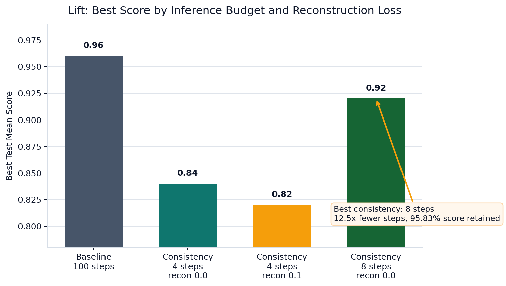
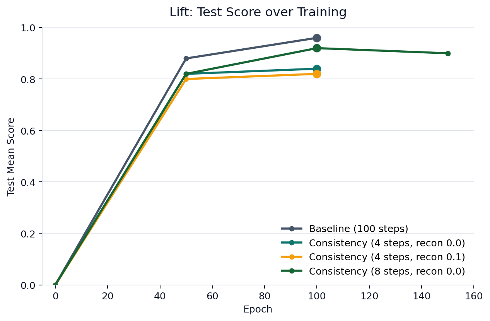

# Diffusion Policy Consistency Exploration

这是一个基于原始 Diffusion Policy 代码库进行学习、整理与实验改造的工程，是一个研究型 / 学习型仓库。

- 代码基础来自原始 Diffusion Policy 项目
- 仓库目标偏向方法理解与工程探索，而不是发布一个已经完善封装的通用库
- 原始开源仓库: <https://github.com/real-stanford/diffusion_policy>
- Consistency model的参考仓库：<https://github.com/quantumiracle/Consistency_Model_For_Reinforcement_Learning>

## 训练成果

### Push-T lowdim

在 Push-T lowdim 任务上，目前这组实验的核心结论是：

- Diffusion Policy UNet baseline: `100` inference steps, best `test_mean_score = 0.8677`
- Consistency Policy: `4` inference steps, best `test_mean_score = 0.8672`
- 在分数几乎保持不变的情况下，将推理步数压缩了 `25x`

Left: Diffusion Policy UNet baseline (100 inference steps)  
Right: Consistency Policy (4 inference steps)

### 结果图表

<table>
  <tr>
    <td width="50%">
      
<strong>Inference steps 与最终性能的关系</strong>

      
    </td>
    <td width="50%">
      
<strong>训练过程中 test score 的变化</strong>

      
    </td>
  </tr>
</table>

### Lift lowdim

实验结果：

- Diffusion Policy UNet baseline: `100` inference steps, best `test_mean_score = 0.96`
- Consistency Policy: `4` inference steps, `reconstruction_loss_weight = 0.0`, best `test_mean_score = 0.84`
- Consistency Policy: `4` inference steps, `reconstruction_loss_weight = 0.1`, best `test_mean_score = 0.82`
- Consistency Policy: `8` inference steps, `reconstruction_loss_weight = 0.0`, best `test_mean_score = 0.92`

从这四组结果看：

- 在 Lift 上，把 consistency policy 的推理步数从 `4` 提高到 `8`，比加入轻量 reconstruction term 更有效。最佳分数从 `0.84` 提升到了 `0.92`
- `8` inference steps 的 consistency policy 只比 baseline 低 `0.04`，但推理步数减少了 `12.5x`
- 在 `4` inference steps 设置下，`reconstruction_loss_weight = 0.1` 没有带来收益，反而比 `reconstruction_loss_weight = 0.0` 低 `0.02`

<table>
  <tr>
    <td width="50%">
      
<strong>不同 inference steps / recon 配置下的最好分数</strong>

      
    </td>
    <td width="50%">
      
<strong>四组 Lift 实验在训练过程中的 test score 变化</strong>

      
    </td>
  </tr>
</table>

## Training Tip
- 在 Push-T lowdim 上，noise-scale curriculum 对 consistency training 的稳定性非常重要。早期实验中，我直接使用完整的 scale 范围进行训练，优化效果较差，最终性能也明显偏低。后续引入课程学习后，将训练 scale 从 `2` 逐步增加到 `150`，训练过程明显更稳定，最终模型达到了 `test_mean_score = 0.8672`。
- 我还尝试加入了类似 BC 的 reconstruction term 来增强训练稳定性。但在当前这组实验中，这一项没有带来明确的性能提升。就目前仓库中的结果来看，Push-T lowdim 上的最佳 consistency 模型仍然来自 `reconstruction_loss_weight = 0.0` 的设置。若要对这一点下更强结论，还需要更严格的控制变量实验。
- 在 Lift lowdim 上，目前更值得优先尝试的是增加 consistency policy 的 inference steps，而不是在 `4` steps 设置里加入小权重的 reconstruction loss。当前结果里，`4` steps 从 `0.84` 加到 `0.82` 没有提升，而 `8` steps 可以达到 `0.92`
